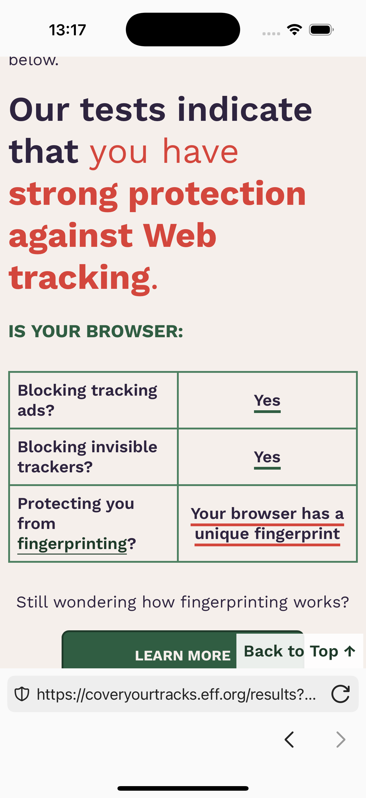
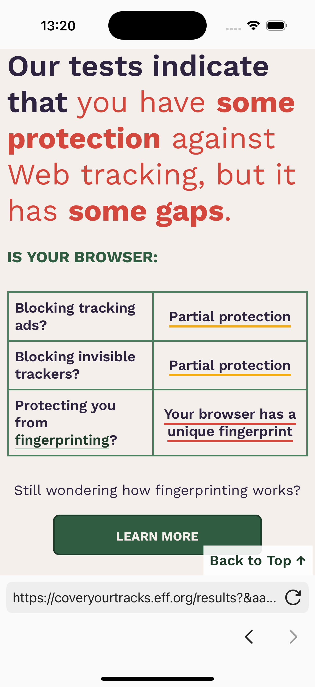
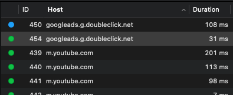
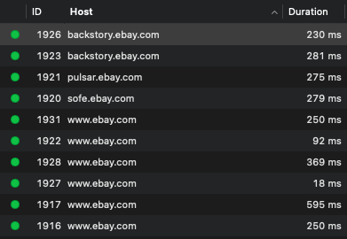
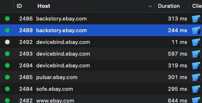
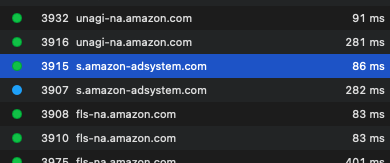
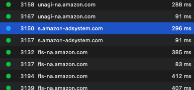
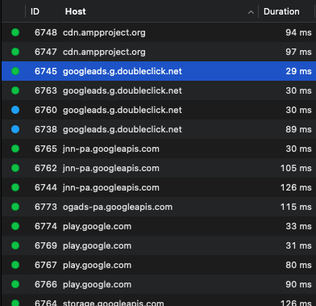

# Tests

## Automated: Unit Tests
The project includes a comprehensive suite of unit tests to ensure the reliability and correctness of the application's core functionalities. Below is a summary of the key unit tests implemented:

- **WKContentRuleListManagerTests**
  - Validates the initialization process with various scenarios, such as no cached rules or new ETag values.
  - Tests the handling of whitelist domain updates and ensures that rule list updates are triggered appropriately.

- **WebViewModelTests**
  - Tests the loading of default and specific URLs, including handling invalid URLs by performing searches.
  - Verifies navigation actions such as going back and forward.
  - Ensures the correct handling of rule list state updates and their impact on the current web page.

- **WhitelistDomainsListViewModelTests**
  - Tests the addition of valid, invalid, and duplicate domains to the whitelist.
  - Ensures that appropriate alerts are presented for invalid or duplicate domain entries.

These tests are designed to cover critical aspects of the application's functionality, providing confidence in the app's behavior and facilitating future development and refactoring efforts.

## Manual Tests

### Tracker Functionality Verification
- **Test Description:** Executed tests on [Cover Your Tracks](https://coveryourtracks.eff.org/) with tracker functionality enabled and disabled.
- **Expected Behavior:** The application should exhibit different behaviors based on the tracker functionality state.
- **Result:** OK

| Enhanced Protection Enabled | Enhanced Protection Disabled |
|--------|------------|
|  |  |

### Tracker Detection via Proxyman

**Test Description:** Monitored network requests for tracker activity on the following websites using Proxyman.

**Results and Observations:**

| Website  | Enhanced Protection Enabled | Enhanced Protection Disabled | Time to Load (ms) | Results |
|----------|-----------------------------|------------------------------|------------------|------------------|
| Youtube  |  |  | ~180ms vs ~180ms | OK |
| Ebay  |  |  | ~900ms vs ~900ms | OK |
| Amazon   |  |  |  ~1100ms vs ~1100ms | KO |
| Google |  |  | ~1600ms vs ~1600ms | OK |

  - **Youtube:** Common trackers are not found.
  - **Ebay:** Common trackers are not found.
  - **Amazon:** Still some trackers are found like https://s.amazon-adsystem.com/.
  - **Google:** Trackers like https://googleads.g.doubleclick.net/ are not found.

All these websites loaded properly with enhanced protection enabled.

## Performance Tests

### Device and Environment
- **Device:** iPhone 13 mini
- **Operating System:** iOS 18.3.1

### Test Details
- **Test Description:** Performance measurement of rule list compilation.
- **Input File:** TDS file with a size of 1.9 MB
- **Compilation Time:** 3000 ms to 4000 ms