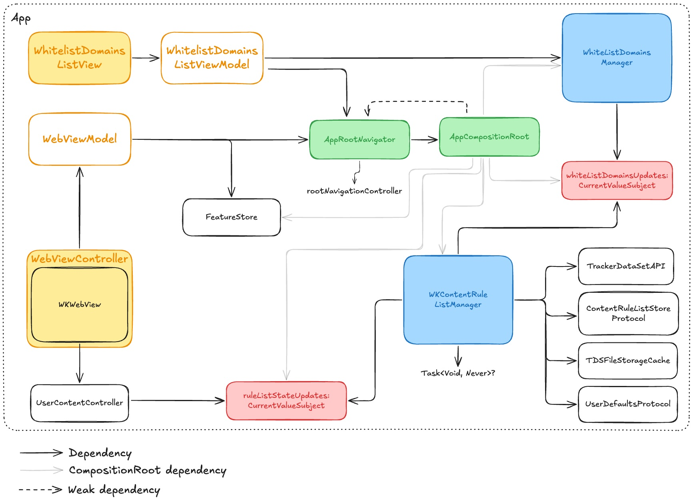

# TrackerBlocker iOS App - MVP

## Overview
This document provides an overview of the implementation choices, architecture decisions, and potential improvements for the TrackerBlocker App. The goal of this challenge was to build a minimal yet functional web browsing experience while maintaining code clarity and maintainability that blocks trackers and ads using DuckDuckGo's Content Blocking Rules hosted on this [url](https://staticcdn.duckduckgo.com/trackerblocking/v2.1/tds.json).

## Dependencies

### TrackerRadarKit
- **Repository:** [TrackerRadarKit](https://github.com/duckduckgo/TrackerRadarKit)
- **Version:** 2.1.2
- **License:** Apache-2.0
- **Description:** TrackerRadarKit is used to generate content blocking rules from DuckDuckGo's Tracker Radar data. It helps in compiling a content rule list using Apple's WKContentRuleListStore, which is then applied to WKUserContentController to block trackers and ads.

## Project Setup

### Development Environment
- **MacOS:** 15.3.1 (24D70)
- **Xcode:** 16.2
- **iOS:** 18.2
- **Swift:** 5.10
- **Tuist:** 4.43.2

### Minimum iOS Version
- **Minimum iOS Version:** 17.0
- **Reason:** iOS 17 is supported by most of the devices, ensuring a wide range of compatibility while allowing the use of the latest features and improvements.

### Tuist
- **Why Tuist?**
  - Tuist was chosen to manage the Xcode project efficiently and improve maintainability.
  - It simplifies project generation, dependency management, and reduces merge conflicts.
- **How to Use It?**
  - Ensure Mise is installed:
    ```bash
    curl -Ls https://install.mise.io | bash
    ```
  - Use Mise to install Tuist:
    ```bash
    mise install tuist
    ```
  - Run `tuist generate` inside Apps/iOS folder to create the `.xcodeproj` and `.xcworkspace` files.
  - Open the `.xcworkspace` file and build the project.
- **Running Without Tuist**
  - Necessary files have been included to allow opening the project without relying on Tuist.
  - Just open the `.xcworkspace` file inside Apps/iOS and build the project.

## Build Configurations
The project includes the following schemes:
- **Alpha** – Used for early-stage development.
- **Beta** – More stable, used for testing before release.
- **Release** – Production-ready build configuration.

## Implemented Features
- Load URL or enter search query.
- Display error view when the web page fails to load.
- Progress bar to indicate page loading progress.
- Accessibility support added.
- Full **dark mode** support.
- Landscape and portrait mode support.
- Fully localized UI in English and Spanish.
- Hide address bar when scrolling down the content to increase the visible area.

### Screenshots
| Web View | Error View |  Whitelist View |
|------------|-----------|-----------|
|  |  |  |
|  |  |  |


## Architecture



* Interfaces have been omitted for simplicity's sake.

## Architectural Choices

### AppDelegate vs SceneDelegate
- **Why AppDelegate?**
  - Since the main view is built using UIKit, AppDelegate was chosen instead of SceneDelegate for simplicity.
  - SceneDelegate is primarily beneficial for multi-window support, which is not a requirement for this challenge.

### UIKit Over SwiftUI for WebViewController
- **Why UIKit?**
  - WKWebView is not natively supported in SwiftUI.
  - Avoiding unnecessary bridging and ensuring better control over web view behavior.

### MVVM Architecture
- **Why MVVM?**
  - Provides a clear separation between the UI (View) and business logic (ViewModel).
  - Works well with both UIKit and SwiftUI.

## Assets & UI Design
Several assets have been taken from the DuckDuckGo repository to replicate the look and feel as closely as possible.

## Key Changes from the Original Implementation

### Task vs OperationQueue
- **Why Task?**
  - `Task` was chosen instead of `OperationQueue` for better control over async execution.
  - Easier to cancel the previous task and prevent continuation issues.
  - Allows checking the state of the current task effectively.

### Removed `WKWebViewProvider` and `WebViewProvider`
This functionality is now handled inside `AppCompositionRoot.createWebViewController`, eliminating the need for separate providers.

### Removed WhitelistDomainsManager's FileStorageCache
The functionality of WhitelistDomainsManager is so straightforward that it doesn't need a test at this point, as it would be testing almost no logic.

## Potential Enhancements

### Gesture Controls for Web Navigation
- Implement drag gestures to go **back** (left swipe) and **forward** (right swipe).
- Add pull-to-refresh support for refreshing the current web page.

### Better Animations
Implement better animations for the UI changes like adding/removing from the whitelist or progress bar transitions.

### Navigation from SwiftUI views
For simplicity, we are using the visibleViewController to present alerts and dismiss itself, referring to WhitelistDomainsListView. Other alternatives are:
- Passing the UIHostingController reference to the ViewModel.
- Using a delegate or closure on the ViewModel to handle the navigation in the AppCompositionRoot.
Both alternatives were more complex to implement than the current solution.

### Analytics & FeatureStore
Empty implementations were provided as placeholders for an MVP setup within the code challenge context.

### Enhance Single Responsibility Principle
WKContentRuleListManager is doing too many thigs on the current implementation. Should be splitted into smaller classes, for instance:
- One for managing the rule list compilation.
- One for managing ETag and TDS file fetching and caching.
- One for doing the current coordination.

### Modularization by Feature
- **Why Modularization?**
  - Improves encapsulation and allows running tests for specific features independently.
  - Sets a better foundation for future improvements.
  - Simplifies adding a macOS app in the future if needed.
- **Current Status:**
  - The folder structure is already organized in this direction.
  - Tuist makes easier to create modules by feature.

### Testing
- Some unit tests require necessary delays, which impact execution speed.
- Implement some End-To-End tests for removing protections from the current page and adding new whitelisted domains.
- Implement some screenshot tests for the UI of the WebViewController and the WhitelistDomainsListView.

## Tests
- [reference](Apps/iOS/doc/TESTS.md)
